# Linux Network

Настройка сетей в Linux на виртуальных машинах

## Оглавление
[Часть 1. Инструмент ipcalc](#часть-1-инструмент-ipcalc)  
[Часть 2. Статическая маршрутизация между двумя машинами](#часть-2-статическая-маршрутизация-между-двумя-машинами)  
[Часть 3. Утилита iperf3](#часть-3-утилита-iperf3)  
[Часть 4. Сетевой экран](#часть-4-сетевой-экран)  
[Часть 5. Статическая маршрутизация сети](#часть-5-статическая-маршрутизация-сети)  
[Часть 6. Динамическая настройка IP с помощью DHCP](#часть-6-динамическая-настройка-ip-с-помощью-dhcp)  
[Часть 7. NAT](#часть-7-nat)  
[Часть 8. Допополнительно. Знакомство с SSH Tunnels](#часть-8-допополнительно-знакомство-с-ssh-tunnels)

## Часть 1. Инструмент ipcalc

>ipcalc предоставляет простой метод для вычисления IP-информации хоста. 

### 1.1. Сети и маски

Устанавливаю утилиту `apt-get install ipcalc`

#### Адрес сети 192.167.38.54/13

Вычисляю адрес сети `ipcalc 192.167.38.54/13`

#### Перевод маски 255.255.255.0 в префиксную и двоичную запись

Вычисляю маску сети `ipcalc 0.0.0.0/255.255.255.0`

#### Перевод маски /15 в обычную и двоичную запись

Вычисляю маску сети `ipcalc 0.0.0.0/15`

- 255.254.0.0 - обычный вид

- 11111111.11111110.00000000.00000000 - двоичная запись

#### Перевод маски 1111111.11111111.11111111.11110000 в обычную и префиксную запись

>ipcalc не работает с двоичной записью

Вычисляю маску сети `ipcalc 0.0.0.0/28`

#### Минимальный и максимальный хост в сети 12.167.38.4/8, 11111111.11111111.00000000.00000000, 255.255.254.0 и /4

`ipcalc 12.167.38.4/8`

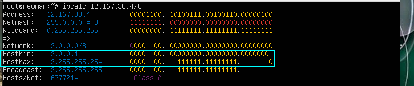

#### Минимальный и максимальный хост в сети 12.167.38.4/11111111.11111111.00000000.00000000

`ipcalc 12.167.38.4/16`

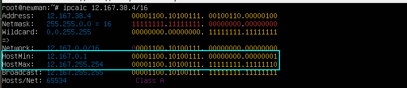

#### Минимальный и максимальный хост в сети 12.167.38.4/255.255.254.0 

`ipcalc 12.167.38.4/255.255.254.0`

#### Минимальный и максимальный хост в сети 12.167.38.4/4

`ipcalc 12.167.38.4/4`

### 1.2. localhost
##### Определи и запиши в отчёт, можно ли обратиться к приложению, работающему на localhost, со следующими IP: *194.34.23.100*, *127.0.0.2*, *127.1.0.1*, *128.0.0.1*

>Для определения возможности обращения к приложению, работающему на локальном хосте, с IP-адресом *.*.*.*, можно воспользоваться командой ping

Пингую следующие IP: `194.34.23.100`, `127.0.0.2`, `127.1.0.1`, `128.0.0.1`

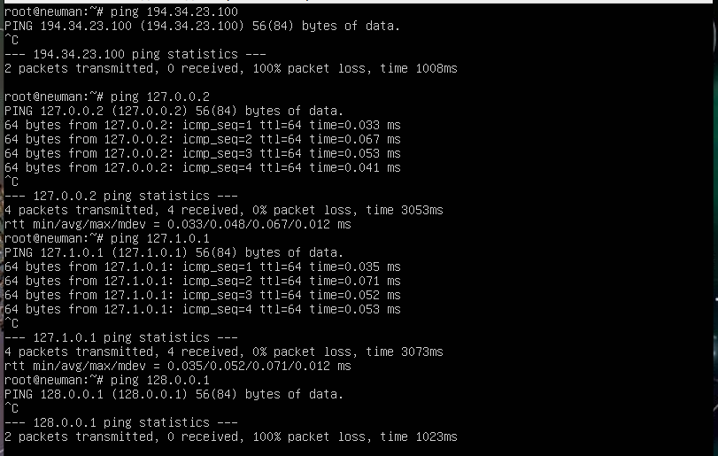

- Можно:      
127.1.0.1;    
127.0.0.2. 
- Нельзя:          
194.34.23.100;           
128.0.0.1.

### 1.3. Диапазоны и сегменты сетей

#### 1) Какие из перечисленных IP можно использовать в качестве публичного, а какие только в качестве частных: 10.0.0.45, 134.43.0.2, 192.168.4.2, 172.20.250.4, 172.0.2.1, 192.172.0.1, 172.68.0.2, 172.16.255.255, 10.10.10.10, 192.169.168.1

>IP-адреса из протоколов 10.xxx , 172..xx и 192.168.xx являются частными и предназначены для использования в локальных сетях.Они не маршрутизируются через Интернет и не используются для создания мировых сетей.IP-адреса из других диапазонов, таких как 134.xxx , 192.xxx (за исключением 192.168.xx), могут использоваться в качестве общедоступных IP-адресов и маршрутизироваться через Интернет.

>Чтобы как-то отличать белую и серую адресацию, во всем мире было принято решение выделить из общего диапазона адресов четыре подсети:

>10.0.0.0 – 10.255.255.255 с маской 255.0.0.0;
>172.16.0.0 – 172.31.255.255 с маской 255.240.0.0;
>192.168.0.0 – 192.168.255.255 с маской 255.255.0.0;
>100.64.0.0 – 100.127.255.255 с маской 255.192.0.0 (RFC6598 рекомендует использовать данную подсеть для использования в качестве адресов для CG-NAT).

1) Частные:
- 10.0.0.45
- 192.168.4.2
- 172.20.250.4
- 172.16.255.255
- 10.10.10.10

2) Публичные:
- 134.43.0.2
- 172.0.2.1
- 192.172.0.1
- 172.68.0.2
- 192.169.168.1

#### 2) Какие из перечисленных IP адресов шлюза возможны у сети 10.10.0.0/18: 10.0.0.1, 10.10.0.2, 10.10.10.10, 10.10.100.1, 10.10.1.255

С помощью утлиты ipcalc опеределяем min и max хоста в сети

`ipcalc 10.10.0.0/18`

- HostMin: 10.10.0.1
- HostMax: 10.10.63.254

Возможные шлюзы для сети: 10.10.0.2, 10.10.10.10, 10.10.1.255

## Часть 2. Статическая маршрутизация между двумя машинами
#### Поднять две виртуальные машины (далее -- ws1 и ws2)

Клонирую первую машину, добавляю локальную сеть, устанавливаю имя хоста ws2 `hostnamectl set-hostname ws2`

##### С помощью команды ip a посмотреть существующие сетевые интерфейсы

ws1 `ip a`

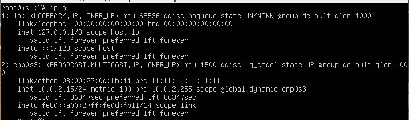

ws2 `ip a`

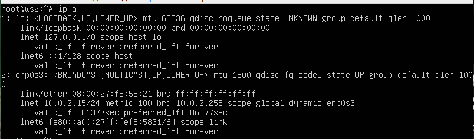

##### На обеих машинах задать следующие адреса и маски: ws1 - 192.168.100.10, маска /16, ws2 - 172.24.116.8, маска /12

Для каждой из машин `nano /etc/netplan/00-installer-config.yaml` и применяем настройки `netplan apply`

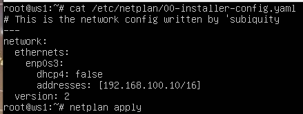

### 2.1. Добавление статического маршрута вручную
#### Пингую соединение между машинами

` ip r add 172.24.116.8 dev enp0s3` и `ping -c 4 172.24.116.8`

` ip r add 192.168.100.10 dev enp0s3` и `ping -c 4 192.168.100.10`

### 2.2. Добавление статического маршрута с сохранением

Перезапускаю машины `reboot`

#### Добавить статический маршрут от одной машины до другой с помощью файла etc/netplan/00-installer-config.yaml
#### Пингую соединение между машинами

Для каждой из машин `nano /etc/netplan/00-installer-config.yaml` 

Применяем настройки `netplan apply`

`ping -c 4 172.24.116.8` и `ping -c 4 192.168.100.10`

## Часть 3. Утилита iperf3
#### Перевести и записать в отчёт: 8 Mbps в MB/s, 100 MB/s в Kbps, 1 Gbps в Mbps

- 8 Mbps = 1 MB/s
- 100MB/s = 800000Kbps
- 1Gbps = 1000Mbps

#### Измерить скорость соединения между ws1 и ws2

Слушаю на стороне сервера `iperf3 -s -f K` и на стороне клиента `-с 192.168.100.10`

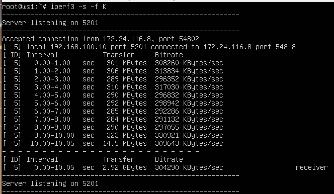
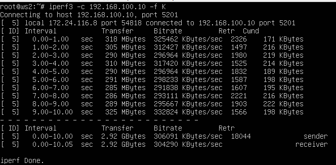

>-c (клиент),
>-s (сервер), 
>-f (формат выводимых данных, доступны значения: k,m,g,t,K,M,G,T), 
>K - Вы можете сразу указать в каких единицах измерения хотите видеть результаты. Для этого используется опция -f.

## Часть 4. Сетевой экран

### 4.1. Утилита iptables

Создаю файл /etc/firewall.sh, имитирующий фаервол на обеих машинах `nano /etc/firewall.sh`

Запускаю файлы на обеих машинах командами `chmod +x /etc/firewall.sh` и `sh /etc/firewall.sh`

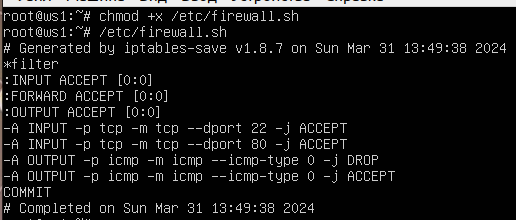

### 4.2. Утилита nmap

 Пингую машины, затем вызываю утилиту nmap, вывод nmap должен показать (хост машины запущен) `Host is up`

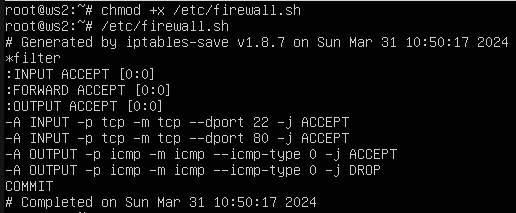

## Часть 5. Статическая маршрутизация сети

### 5.1. Настройка адресов машин
#### Настраиваю конфигурацию машин согласно схеме на рисунке

netplan ws11, ws21, ws22, r1, r2 

Применяю настройки на каждой из машин `netplan apply`

Проверяю настройки на каждой машине `ip -4 a`

ws11, ws21, ws22, r1, r2

Пингую ws22 с ws21 `ping -c 4 10.20.0.20`

Пингую r1 с ws11 `ping -c 4 10.10.0.1`

### 5.2. Включение переадресации IP-адресов.

Включаю переадресацию IP, на роутерах `sysctl -w net.ipv4.ip_forward=1`

Открываю файл конфигурации на обеих машинах `nano /etc/sysctl.conf`

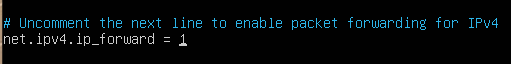

### 5.3. Установка маршрута по-умолчанию

#### Настриваю маршрут по-умолчанию (шлюз) для рабочих станций

ws11, ws21, ws22

Применяю настройки на каждой из машин `netplan apply`

#### Проверяю таблицы маршрутиризации

ws11, ws21, ws22 `ip r`

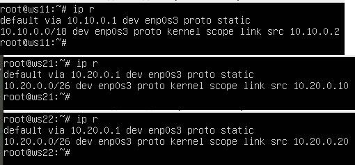

#### Пингую r2 с ws11

ws11 `ping -c 4 10.100.0.12` и смотрю в r2 `tcpdump -tn -i enp0s8`

### 5.4. Добавление статических маршрутов

Добавляю в роутеры r1 и r2 статические маршруты в файле конфигурации

r1, r2

Применяю настройки на обеих роутерах `netplan apply`

r1, r2 `ip r`

Запускаю команды `ip r list 10.10.0.0/18` и `ip r list 0.0.0.0/0` на ws11

>ws11 соединена с сетью 10.10.0.0/18 поэтому, подключение произошло напрямую, но не соединена с 0.0.0.0/0 - сработало дефолное подключение через роутер.

### 5.5. Построение списка маршрутизаторов

 Запускаю команду дампа на r1 `tcpdump -tnv -i enp0s8`

На ws11 `traceroute 10.20.0.10`

>Для определения промежуточных маршрутизаторов traceroute отправляет целевому узлу серию ICMP-пакетов (по умолчанию 3 пакета), с каждым шагом увеличивая значение поля TTL («время жизни») на 1. Это поле обычно указывает максимальное количество маршрутизаторов, которое может быть пройдено пакетом. Первая серия пакетов отправляется с TTL, равным 1, и поэтому первый же маршрутизатор возвращает обратно ICMP-сообщение «time exceeded in transit», указывающее на невозможность доставки данных. Traceroute фиксирует адрес маршрутизатора, а также время между отправкой пакета и получением ответа (эти сведения выводятся на монитор компьютера). Затем traceroute повторяет отправку серии пакетов, но уже с TTL, равным 2, что заставляет первый маршрутизатор уменьшить TTL пакетов на единицу и направить их ко второму маршрутизатору. Второй маршрутизатор, получив пакеты с TTL=1, так же возвращает «time exceeded in transit». Процесс повторяется до тех пор, пока пакет не достигнет целевого узла, тем самым увеличивая значение ttl. При получении ответа от этого узла процесс трассировки считается завершённым.

### 5.6. Использование протокола ICMP при маршрутизации

Запускаю на r1 перехват сетевого трафика `tcpdump -n -i enp0s8 icmp`

Пингую с ws11 несуществующий IP `ping -c 1 10.30.0.111`

## Часть 6. Динамическая настройка IP с помощью DHCP

#### Для r2 настраиваю конфигурацию службы DHCP:

Устанавливаю утилиту `apt-get install isc-dhcp-server`

Открываю конфиг и добавляю изменения в r2 `nano  /etc/dhcp/dhcpd.conf`

В файл resolv.conf прописываю nameserver 8.8.8.8

Перезагружаю службу DHCP `systemctl restart isc-dhcp-server` и проверяю ее статус `systemctl status isc-dhcp-server`

Обновляю настройки в ws21 и ws22

Применяю настройки на обеих машинах `netplan apply`

Перезагружаю ws21 `reboot`

Проверяю, полученный от DHCP адрес

ws21 `ip a`

ws22 `ip a`

Пингую ws22 с ws21  `ping -c 4 10.20.0.5`

Указываю MAC адрес у ws21

В настройках VB

В конфигурационном файле

#### Для r1 настраиваю аналогично r2, но делаю выдачу адресов с жесткой привязкой к MAC-адресу (ws11)

Устанавливаю утилиту `apt-get install isc-dhcp-server`

Открываю конфиг и добавляю изменения в r1 `nano  /etc/dhcp/dhcpd.conf`

В файл resolv.conf прописываю nameserver 8.8.8.8

Перезагружаю службу DHCP `systemctl restart isc-dhcp-server` и проверяю ее статус `systemctl status isc-dhcp-server`

Обновляю настройки в ws11

Применяю настройки `netplan apply`

ws11 `ip a`

Пингую ws11 с ws22  `ping -c 4 10.10.0.2`

#### Запрашиваю с ws21 обновление ip адреса

ip на ws21 до запроса нового `ip a`

Запрос нового ip `dhclient -v`

> -v - получение нового ip

ws11 `ip a`

## Часть 7. NAT

Устанавливаю apache `apt install apache2`

В файле /etc/apache2/ports.conf на ws22 и r1 меняю строку Listen 80 на Listen 0.0.0.0:80

Запускаю веб-сервер на ws22 и r1 `service apache2 start` и проверяю `systemctl status apache2`

Создаю файл /etc/firewall.sh, имитирующий фаервол на r2 `nano /etc/firewall.sh`

Запускаю файл `chmod +x /etc/firewall.sh` и `/etc/firewall.sh`

Пингую ws22 с r1 

Добавляю в фаервол еще одно правило

Пингую ws22 с r1 

Добавляю еще правила в фаервол

>- t - указывает на используемую таблицу
>- p - указывает протокол, такие как tcp, udp, udplite и другие, поддерживаемые системой, ознакомиться со списком можно в файле /etc/protocols
>- m - подключает указанный модуль
>- s - указывает адрес источника пакета, в качестве значения можно указать как один IP-адрес, так и диапазон;
>- i - задает входящий сетевой интерфейс
>- o - указывает исходящий сетевой интерфейс
>- --dport - порт получателя пакета
>- DNAT — подменяет адрес получателя в заголовке - IP-пакета, основное применение — предоставление доступа к сервисам снаружи, находящимся внутри сети
>- SNAT — служит для преобразования сетевых адресов, применимо, когда за сервером находятся машины, которым необходимо предоставить доступ в Интернет, при этом от провайдера имеется статический IP-адрес

Запускаю `/etc/firewall.sh`

Проверяю соединение по TCP для SNAT, для этого с ws22 подключаюсь к серверу Apache на r1 `telnet 10.100.0.11 80`

## Часть 8. Допополнительно. Знакомство с SSH Tunnels

Устанавливаю apache на ws22 `apt install apache2`

В файле /etc/apache2/ports.conf меняю строку Listen 80 на Listen localhost:80

Запускаю веб-сервер на ws22  `service apache2 start` и проверяю `systemctl status apache2`

Запускаю фаервол на r2 `/etc/firewall.sh`

Local TCP forwarding с ws21 до ws22

Remote TCP forwarding c ws11 до ws22

[Оглавление](#оглавление)
